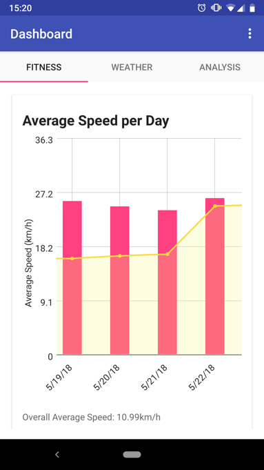
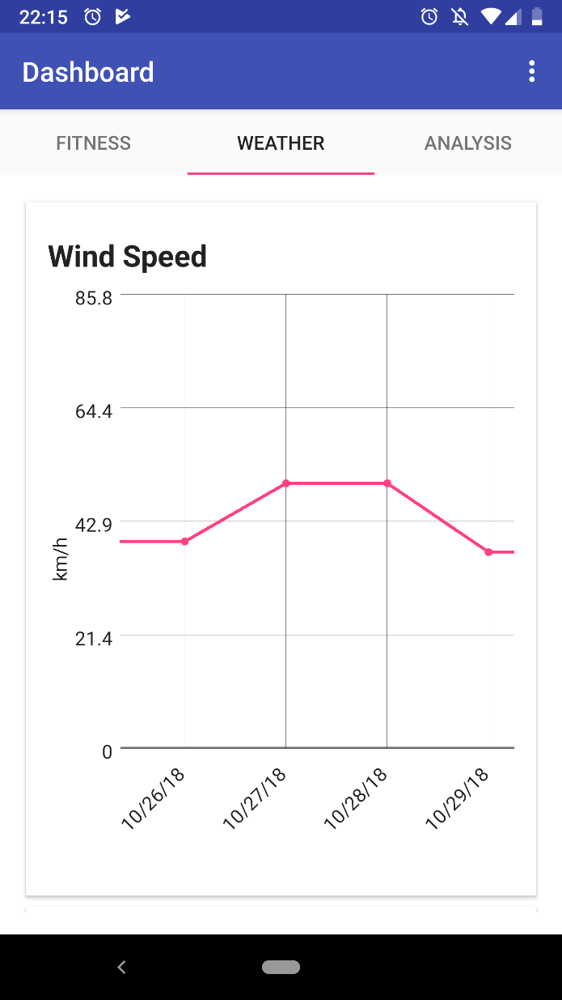
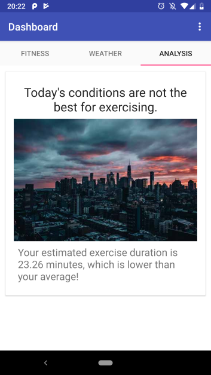
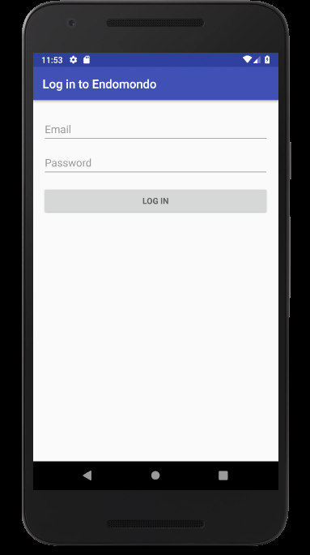
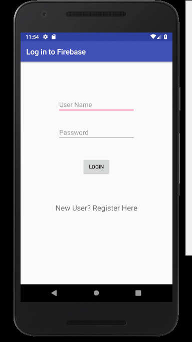
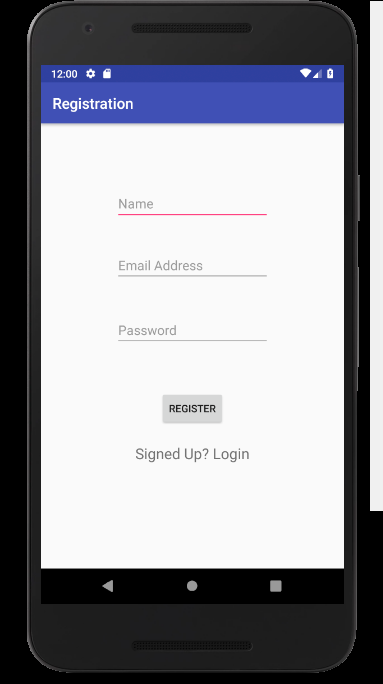
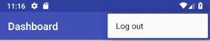

# Fitness Predictor

## How to Setup

### Endomondo

The application requires an Endomondo account. You can create an account
[here](https://www.endomondo.com/).

### Android Studio

The easiest way to setup your development environment is to install [Android
Studio](https://developer.android.com/studio/install).

You need to install an emulator and the sdk. You can then open Android Studio
and open the project.

Press on the 'Run app' button to start the application. You can choose to run it
on either an emulator or a physical device.

### Local account

The application requires a local account. You can register by clicking on the
Register button in the Login prompt.

Sample Login Credentials:
username: test3@example.com
password: asdfasdf

## Screenshots

Here is a list of screenshots showing the functionality of the application.

### Fitness

The dashboard has 3 tabs: fitness, weather, and analysis. The fitness tab displays data from Endomondo in pink and the moving average in yellow. The overall average is displayed under the graph.

### Weather

The weather tab displays the wind speed and temperature in a graph. 

### Analysis

The analysis tab predicts if the current day has favourable conditions to exercise based on historical data. The picture changes depending on the conditions of the day.

### Endomondo Login

The user is required to log in to Endomondo to be able to go further into the application. This allows the application to fetch the workout data tracked by Endomondo to display it.

### Local Login

The user is required to log in with our Firebase database. If the user does not have an existing account, they are able to register an account using the Register button.

### Local Registration

The user is able to register to our application.

### Log out action

The log out action logs out the user from both Endomondo and local login. After
pressing this button, the application will go back to login activities.

## Dependencies

- minSDK: 24
- targetSDK: 27
- Firebase
- [GraphView](www.android-graphview.org/)
- [Fork of Endo2java](https://github.com/tomleb/endo2java/)
- Google services

